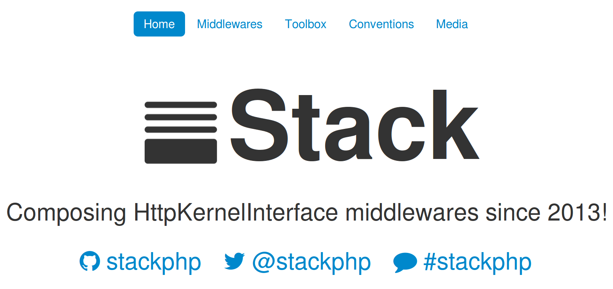
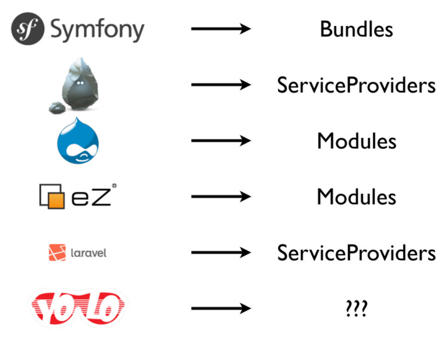
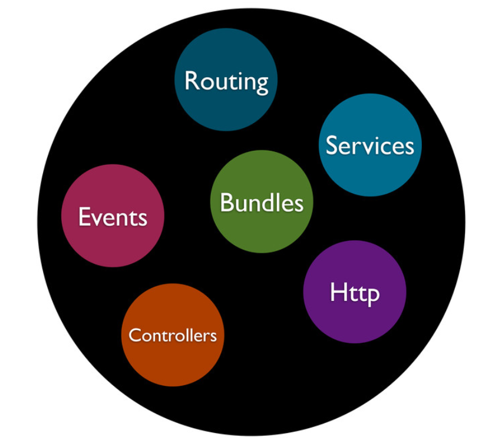

# Symfony UserGroup Hamburg


# Lets talk about ...
\centering


`"Do you stack up?"`


# About me
\centering

Julius Beckmann

(twitter|github).com/__h4cc__

\vspace{0.5cm}
\begin{multicols}{2}
	\begin{itemize}
		\item PHP
		\begin{itemize}
			\item Symfony
			\item Silex
		\end{itemize}
	\vspace{0.5cm}
		\item BEAM
		\begin{itemize}
			\item Erlang
			\item Elixir
		\end{itemize}
		\item DevOps
		\begin{itemize}
			\item Server
			\item Deployment
		\end{itemize}
	\vspace{0.5cm}
		\item Pandoc
		\begin{itemize}
			\item Markdown
			\item \LaTeX
		\end{itemize}
	\end{itemize}
\end{multicols}


#




#
\centering


# Modularization in Frameworks




# Inside the Frameworks




#
\centering
\begin{Huge}
HTTP!
\end{Huge}

`A protocol is a interface.`


# The HttpKernelInterface

\footnotesize

```php
<?php

namespace Symfony\Component\HttpKernel;

interface HttpKernelInterface
{
    const MASTER_REQUEST = 1;
    const SUB_REQUEST = 2;

    /**
     * Handles a Request to convert it to a Response.
     *
     * @return Response
     */
    public function handle(
		Request $request, 
		$type = self::MASTER_REQUEST, 
		$catch = true
	);
}

```

# Example HttpKernelInterface usage

\footnotesize

```php
<?php

$kernel = new AppKernel('dev', true);

$kernel->handle(Request::createFromGlobals())
       ->send();
```

# Base of Stack

\centering
\Huge
_Request_ $\to$ __App__ $\to$ _Response_

\normalsize
\vspace{1cm}

`App extends HttpKernelInterface`


# How would you ....

\centering
\Huge

restrict Access to \newline your App by IP?


# With IpRestrict by Alsar

\footnotesize

```php
<?php

$kernel = new AppKernel('dev', true);

$kernel = new Alsar\Stack\IpRestrict(
	$kernel, 
	array('127.0.0.1', '192.168.0.1')
);

$kernel->handle(Request::createFromGlobals())
       ->send();
```

\large

[https://github.com/alsar/stack-ip-restrict](https://github.com/alsar/stack-ip-restrict)


# With IpRestrict by Alsar

\tiny

```php
<?php

class IpRestrict implements HttpKernelInterface
{
    private $app;
    private $allowedIps;

    public function __construct(HttpKernelInterface $app, array $allowedIps)
    {
        $this->app = $app;
        $this->allowedIps = $allowedIps;
    }

    public function handle(Request $request, $type = self::MASTER_REQUEST, $catch = true)
    {
        $ip = $request->getClientIp();

        if (!in_array($ip, $this->allowedIps)) {
            return new Response(sprintf('IP %s is not allowed.', $ip), 403);
        }

        return $this->app->handle($request, $type, $catch);
    }
}
```

\large

[https://github.com/alsar/stack-ip-restrict](https://github.com/alsar/stack-ip-restrict)


# Principle of Stack

\centering
\Huge

_Request_
$\to$ 

__AnotherApp(App)__ 

$\to$
_Response_


# Wait, how did we do this till now?

__PHP SAPI__ - _Server Application Programming Interface_

\vspace{0.5cm}
Gives us:

* Superglobals
	* `$_REQUEST`
	* `$_SERVER`
	
* Primitives
	* `header()`
	* `echo()`
	* `exit()`

	
# Why use HttpKernelInterface?

`Request`, `App` and `Response` are **values**.

* Inspectable
* Reuseable
* Composeable

\vspace{1cm}

PHP SAPI is **global state**.

* *Nothing of the above*


# Its nothing new ...

* 1997: Java Servlet
* 2003: Python WSGI *(Web Server Gateway Interface)*
* 2007: Ruby Rack
* 2009: Perl PSGI/Plack
* 2011: Symfony HttpKernelInterface

$\to$ Idea is more than *17 Years* around, lets use it!


# Lets check out the toolbox!

\includegraphics[width=0.28\textwidth]{img/toolbox_with_dpi.jpg}

* Builder
* Run
* Session
* URL Map
* Lazy Kernel


# Toolbox: Builder

Stacking Kernels can be confusing, the `Builder` can help here.

```php
<?php

$stack = (new Stack\Builder())
    ->push('Stack\Session')
    ->push('SymfonyHttpCache', new Store('../cache'));

$app = $stack->resolve($app);

```

Result: *Session(SymfonyHttpCache($app, '../cache'))*


# Toolbox: Run

`Stack\run()` is just a shortcut:

\footnotesize

```php
<?php

namespace Stack;

use Symfony\Component\HttpKernel\HttpKernelInterface;
use Symfony\Component\HttpKernel\TerminableInterface;
use Symfony\Component\HttpFoundation\Request;

function run(HttpKernelInterface $app, Request $request = null)
{
    $request = $request ?: Request::createFromGlobals();

    $response = $app->handle($request);
    $response->send();
    if ($app instanceof TerminableInterface) {
        $app->terminate($request, $response);
    }
}
```


# Toolbox: Session

Injecting a Session to the `Request`

\small

```php
<?php

$app = new Silex\Application();
$app->get('/', function (Request $request) {
    $session = $request->getSession();
    // use session ...
});


$stack = (new Stack\Builder())->push('Stack\Session');
    
$app = $stack->resolve($app);
Stack\run($app);
```


# Toolbox: UrlMap

Mapping URL-Prefixes to Apps.

\small

```php
<?php

$map = array(
	'/api' => new ApiKernel(),
	'/blog' => new BlogKernel(),
	'/' => new WebsiteKernel(),
);

$app = (new Stack\Builder())->push('Stack\UrlMap', $map)

$app = $stack->resolve($app);
Stack\run($app);
```


# Toolbox: LazyHttpKernel

Lazy proxy for `HttpKernelInterface`s.

\small

```php
<?php

$map = array(
	'/api' => Stack\lazy(function () {
		return new ApiKernel();
	}),
	'/blog' => Stack\lazy(function () {
		return new BlogKernel();
	}),
	'/' => Stack\lazy(function () {
		return new WebsiteKernel();
	}),
);

// ...
```


# Middlewares

\centering


* Adding functionality.
* Decorating Application.


# List of middlewares

**[stackphp.com/middlewares/](http://stackphp.com/middlewares/)**

\begin{multicols}{2}
\begin{itemize}

\item HttpCache \textit{(by Symfony)}
\item CookieGuard \textit{(by Laravel)}
\item GeoIp \textit{(by geocoder)}
\item IpRestrict \textit{(by alsar)}
\item Backstage \textit{(by atst)}
\item OAuth \textit{(by igorw)}
\item Basic Authentication \textit{(by dflydev)}
\item Hawk \textit{(by dflydev)}
\item CORS \textit{(by asm89)}
\item Robots \textit{(by dongilbert)}
\item Negotiation \textit{(by wildurand)}
\item Honeypot \textit{(by CHH)}
\item Turbolinks \textit{(by Helthe)}
\item Logger \textit{(by h4cc)}

\end{itemize}
\end{multicols}


# List of Apps using HttpKernelInterface

**[symfony.com/components/HttpKernel](http://symfony.com/components/HttpKernel)**

\begin{multicols}{2}
\begin{itemize}

\item Sculpin
\item Symfony
\item Proem Framework
\item phpBB
\item Drupal
\item Thelia
\item Shopware
\item Silex
\item Pagekit
\item Laravel

\end{itemize}
\end{multicols}


# Divine the future

One day, using StackPHP we will:

* Combine multiple Application Kernels to one.

* Use Symfony, Silex, Drupal, Ez, BoltCM, ... in combination.

* Have single-purpose-application, decorated to our needs.

* even interact with external services using HttpKernelInterface.


# Summary

* Using Http as a interface with HttpKernelInterface.

* Decorating Apps is easy.

* Writing own HttpKernel wrapper is easy.

* Nice Toolbox available.

* Public Middleware available


# 
\centering

\Huge
Stop writing Bundles.

\vspace{1cm}

Start writing Middlewares!

#

\centering

\Huge
Questions?
