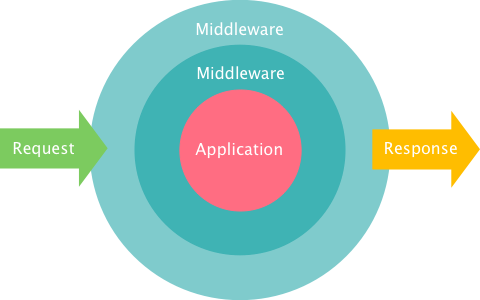

#


 
# Lets talk about ...
\centering


`and the idea behind PSR-7`


# About me
\centering

Hi, i'm
\begin{huge}
Julius Beckmann
\end{huge}

\vspace{0.5cm}
and i work at


#

\centering
\begin{Huge}
How does PHP work?
\end{Huge}


# 

\centering

```php
<?php

// The whole request
// var_dump(
//     $_GET, $_POST, $_SERVER,
//     $_FILES, $_COOKIES, $_SESSION
// );

// Creating a response
header("HTTP/1.1 404 Not Found"); 
echo "Not found";
exit;
```


# 

__PHP SAPI__ - _Server Application Programming Interface_

\vspace{0.5cm}
Gives us:

\begin{multicols}{2}
	\begin{itemize}
		\item Superglobals
		\begin{itemize}
			\item \texttt{\$\_GET}
			\item \texttt{\$\_POST}
			\item \texttt{\$\_SERVER}
			\item ...
		\end{itemize}
		\item Primitives
		\begin{itemize}
			\item \texttt{header()}
			\item \texttt{echo()}
			\item \texttt{exit()}
			\item ...
		\end{itemize}
	\end{itemize}
\end{multicols}

# PHP-SAPI Problems

 * Global state
 * Hard to inspect / debug
 * Hard to reproduce / test


#

\centering
\begin{Huge}
Lets do it better!
\end{Huge}


#
\centering
\begin{Huge}
HTTP
\end{Huge}

`A protocol is a interface.`


# The HttpKernelInterface

\footnotesize

```php
<?php

namespace Symfony\Component\HttpKernel;

interface HttpKernelInterface
{
    const MASTER_REQUEST = 1;
    const SUB_REQUEST = 2;

    /**
     * Handles a Request to convert it to a Response.
     *
     * @return Response
     */
    public function handle(
		Request $request, 
		$type = self::MASTER_REQUEST, 
		$catch = true
	);
}

```


# Why use HttpKernelInterface?

`Request`, `AppKernel` and `Response` are **values**.

* Inspectable
* Reuseable
* Composeable

\vspace{1cm}

PHP SAPI is **global state**.

* *Nothing of the above*


# Its nothing new ...

* 1997: Java Servlet
* 2003: Python WSGI *(Web Server Gateway Interface)*
* 2007: Ruby Rack
* 2009: Perl PSGI/Plack
* 2011: Symfony HttpKernelInterface
* ????: _PSR-7: HTTP message interfaces_

$\to$ Idea is more than *17 Years* around, lets use it!


#
\centering
\begin{Huge}
Leverage

\NormalTok{HttpKernelInterface}

using StackPHP
\end{Huge}


#


#
\centering


#

Needed composer packages:

\centering

```
{
    "require": {
        "symfony/http-kernel": "~2.0",
        "symfony/http-foundation": "~2.0"
    }
}
```


# Example HttpKernelInterface usage

\footnotesize

```php
<?php

$kernel = new AppKernel('dev', true);

$response = $kernel->handle(Request::createFromGlobals());

$response->send();
```

#

\centering
\Huge
_Request_
$\to$ 

__AppKernel__ 

$\to$
_Response_

\normalsize
\vspace{1cm}

`AppKernel extends HttpKernelInterface`


# How would you ....

\centering
\Huge

restrict Access by IP?


# With IpRestrict by Alsar

\footnotesize

```php
<?php

$kernel = new AppKernel('dev', true);

$kernel = new Alsar\Stack\IpRestrict(
	$kernel, 
	array('127.0.0.1', '192.168.0.1')
);

$response = $kernel->handle(Request::createFromGlobals());

$response->send();
```

\large

[https://github.com/alsar/stack-ip-restrict](https://github.com/alsar/stack-ip-restrict)


<!--
# Source of IpRestrict

\tiny

```php
<?php

class IpRestrict implements HttpKernelInterface
{
    private $app;
    private $allowedIps;

    public function __construct(HttpKernelInterface $app, array $allowedIps)
    {
        $this->app = $app;
        $this->allowedIps = $allowedIps;
    }

    public function handle(Request $request, $type = self::MASTER_REQUEST, $catch = true)
    {
        $ip = $request->getClientIp();

        if (!in_array($ip, $this->allowedIps)) {
            return new Response(sprintf('IP %s is not allowed.', $ip), 403);
        }

        return $this->app->handle($request, $type, $catch);
    }
}
```

\large

[https://github.com/alsar/stack-ip-restrict](https://github.com/alsar/stack-ip-restrict)
-->


# Principle of Stack

\centering
\Huge

_Request_
$\to$ 

__DecoratingApp(App)__ 

$\to$
_Response_


# StackPHP is ...

\LARGE

StackPHP is __NOT__ a Framework

StackPHP is __NOT__ a Library

StackPHP is a Toolset and Conventions


# StackPHP Conventions

1. Implement the __HttpKernelInterface__
2. Take the decorated app as the __first constructor argument__
3. __Decorate__ the handle call, __delegate__ to the decorated app

__More__ can be found here: _[stackphp.com/specs](http://stackphp.com/specs/)_.


# Lets check out the toolbox!

\includegraphics[width=0.28\textwidth]{img/toolbox_with_dpi.jpg}

* Builder
* Run
* Session
* URL Map
* Lazy Kernel


# Toolbox: Builder

Stacking Kernels can be confusing, the `Builder` can help here.

```php
<?php

$stack = (new Stack\Builder())
    ->push('Stack\Session')
    ->push('SymfonyHttpCache', new Store('../cache'));

$app = $stack->resolve($app);

```

Result: *Session(SymfonyHttpCache($app, '../cache'))*


# Toolbox: Run

`Stack\run()` is just a shortcut:

\footnotesize

```php
<?php

namespace Stack;

use Symfony\Component\HttpKernel\HttpKernelInterface;
use Symfony\Component\HttpKernel\TerminableInterface;
use Symfony\Component\HttpFoundation\Request;

function run(HttpKernelInterface $app, Request $request = null)
{
    $request = $request ?: Request::createFromGlobals();

    $response = $app->handle($request);
    $response->send();
    if ($app instanceof TerminableInterface) {
        $app->terminate($request, $response);
    }
}
```


# Toolbox: Session

Injecting a Session to the `Request`

\small

```php
<?php

$app = new Silex\Application();
$app->get('/', function (Request $request) {
    $session = $request->getSession();
    // use session ...
});


$stack = (new Stack\Builder())->push('Stack\Session');
    
Stack\run($stack->resolve($app));
```


# Toolbox: UrlMap

Mapping URL-Prefixes to Apps.

\small

```php
<?php

$map = array(
	'/api' => new ApiKernel(),
	'/blog' => new BlogKernel(),
	'/' => new WebsiteKernel(),
);

$app = (new Stack\Builder())->push('Stack\UrlMap', $map)

Stack\run($stack->resolve($app));
```


# Toolbox: LazyHttpKernel

Lazy proxy for `HttpKernelInterface`s.

\small

```php
<?php

$map = array(
	'/api' => Stack\lazy(function () {
		return new ApiKernel();
	}),
	'/blog' => Stack\lazy(function () {
		return new BlogKernel();
	}),
	'/' => Stack\lazy(function () {
		return new WebsiteKernel();
	}),
);

// ...
```


# Middlewares

Adding functionality by decorating Application.

\centering




# Example Middleware

\centering

\tiny

```php
<?php

class MyMiddleware implements HttpKernelInterface
{
    private $app;

    public function __construct(HttpKernelInterface)
    {
        $this->app = $app;
    }

    public function handle(Request $request, $type = self::MASTER_REQUEST, $catch = true)
    {
        // Before request
        
        $response = $this->app->handle($request, $type, $catch);
        
        // After response
        
        return $response;
    }
}
```


# What the Stack logo means


# List of middlewares

**[stackphp.com/middlewares/](http://stackphp.com/middlewares/)**

\begin{multicols}{2}
\begin{itemize}

\item HttpCache \textit{(by Symfony)}
\item CookieGuard \textit{(by Laravel)}
\item GeoIp \textit{(by geocoder)}
\item IpRestrict \textit{(by alsar)}
\item Backstage \textit{(by atst)}
\item OAuth \textit{(by igorw)}
\item Basic Authentication \textit{(by dflydev)}
\item Hawk \textit{(by dflydev)}
\item CORS \textit{(by asm89)}
\item Robots \textit{(by dongilbert)}
\item Negotiation \textit{(by wildurand)}
\item Honeypot \textit{(by CHH)}
\item Turbolinks \textit{(by Helthe)}
\item Logger \textit{(by h4cc)}

\end{itemize}
\end{multicols}


# List of Apps using HttpKernelInterface

**[symfony.com/components/HttpKernel](http://symfony.com/components/HttpKernel)**

\begin{multicols}{2}
\begin{itemize}

\item Sculpin
\item Symfony
\item Proem Framework
\item phpBB
\item Drupal
\item Thelia
\item Shopware
\item Silex
\item Pagekit
\item Laravel

\end{itemize}
\end{multicols}


# What about PSR-7 ?

StackPHP is currently using `symfony` packages.

\vspace{0.5cm}

A equal PSR-Standard is proposed, but not yet ready :(

But let me show you the drafts...


# PSR-7 MessageInterface DRAFT

Base for `Request` and `Response` 

\centering
\tiny

```php
<?php

namespace Psr\Http\Message;

interface MessageInterface
{
    public function getProtocolVersion();
    
    public function getBody();
    public function setBody(StreamInterface $body = null);
    
    public function getHeaders();
    public function hasHeader($header);
    public function getHeader($header);
    public function getHeaderAsArray($header);
    public function setHeader($header, $value);
    public function setHeaders(array $headers);
    public function addHeader($header, $value);
    public function addHeaders(array $headers);
    public function removeHeader($header);
}
```


# PSR-7 RequestInterface DRAFT

\centering
\tiny

```php
<?php

namespace Psr\Http\Message;

interface RequestInterface extends MessageInterface
{
    public function getMethod();
    public function setMethod($method);

    public function getUrl();
    public function setUrl($url);
}
```

# PSR-7 ResponseInterface DRAFT

\centering
\tiny

```php
<?php

namespace Psr\Http\Message;

interface ResponseInterface extends MessageInterface
{
    public function getStatusCode();
    public function setStatusCode($code);

    public function getReasonPhrase();
    public function setReasonPhrase($phrase);
}
```


<!--
# Divine the future

One day, using StackPHP we will:

* Combine multiple Application Kernels to one.

* Use Symfony, Silex, Drupal, Ez, BoltCM, ... in combination.

* Have single-purpose-application, decorated to our needs.

* even interact with external services using HttpKernelInterface.
-->


# Summary

* Using __Http as a interface__ with HttpKernelInterface.

* __Compose__ simple Applications.

* Add functionality through __Middlewares__.

* Build __framework-agnostic features__ based on HTTP.


# Some stuff i did with StackPHP

* Request/Response logger: __[silpion/stack-logger](https://github.com/h4cc/StackLogger)__


* REST fileserver application: __[h4cc/stack-flysystem](https://github.com/h4cc/stack-flysystem)__


* StackPHP adapter for [Mongrel2](http://mongrel2.org/): __[h4cc/stack-mongrel2](https://github.com/h4cc/stack-mongrel2)__


* [ReactPHP](http://reactphp.org/) StackPHP Handler: __[yosymfony/httpserver](https://github.com/yosymfony/HttpServer)__


* _More not yet released stuff ..._


<!--
# 
\centering

\Huge
Stop writing Bundles.

\vspace{1cm}

Start writing Middlewares!
-->


# About me
\centering

Julius Beckmann

(twitter|github).com/__h4cc__

\vspace{0.5cm}
\begin{multicols}{2}
	\begin{itemize}
		\item PHP
		\begin{itemize}
			\item Symfony
			\item Silex
		\end{itemize}
	\vspace{0.5cm}
		\item BEAM
		\begin{itemize}
			\item Erlang
			\item Elixir
		\end{itemize}
		\item DevOps
		\begin{itemize}
			\item Server
			\item Deployment
		\end{itemize}
	\vspace{0.5cm}
		\item Pandoc
		\begin{itemize}
			\item Markdown
			\item \LaTeX
		\end{itemize}
	\end{itemize}
\end{multicols}


#

\centering

\Huge
Questions?
